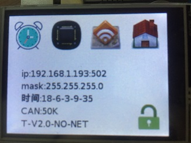
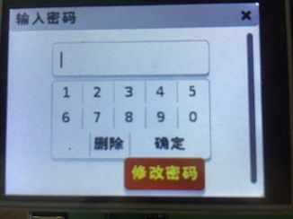
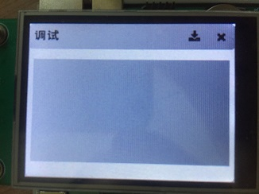
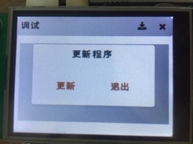
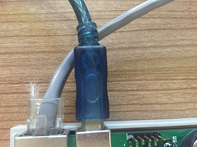

# 设备使用
## 主界面


> 设备主界面 时间设置 程序更新 网络设置 can设置

> ip 表示当前设备IP地址为192.168.1.193 端口号为502
>> 可以使用ping测试网络 是否正常运行
>>> '

> 右下角的锁图标 表示当前设备是否可以操作 当‘锁’图标被锁上后 点击‘锁’ 图标会出现如下界面
>> 
>>> 输入密码 ‘123456’ 可解锁设置

## 程序更新界面


>> 右上角的‘X’图标 退出当前界面 第二个下载图标用户更新程序，下面的方框用于显示调试信息可使用print 输出字符
>> 点击下载图标出现程序更新提示
>>> 

>>>  如下图 插上USB更新线
>>>> 

>>>> 点击更新按钮,电脑上会显示大小为11.9M的U盘

>>>> '

>>>>> 创建 main.lua 文件 保存到设备U盘 然后点击屏幕上的更新完成按钮 程序就成功下载到设备上了
>>>>>> 
---
# 编辑工具
lua代码编辑推荐使用notpad++ 编辑代码
> npp.7.5.8.Installer.exe 资料文件下有软件安装包 安装即可
---
# 演示代码文件
> main.lua 资料文件有演示代码文件 按照上面的方法下载带设备上就可以运行
---
# LUA内建API介绍

```lua
equipment.delay(x)               --阻塞延时 单位毫秒 1S=1000MS
equipment.holeing_set(x,val)     --设置中间继电器x地址 val值
equipment.holeing_get(x)         --设置地址值 x地址
equipment.coils_set(adr,num,val) --设置DO-8 地址 第几个线圈 值  当地址=8 对整个设备操作
equipment.coils_get(adr,num)     --获取DO-8 地址 第几个线圈 当地址=8 获取整个设备情况
equipment.input_get()            --获取DI-4  地址 第几个按钮
-- 新增接口 modbus 转 can
equipment.modbus_get(2,1,1,3,1)  -- 地址  modbus从机地址  变量地址 变量类型  读取存放到 hold 的地址
equipment.modbus_set(2,1,4,3,equipment.holeing_get(5)) -- 地址  modbus从机地址  变量地址 变量类型  设置的值
-- 主机485接口
equipment.re485_baud(9600); -- 设置485波特率
equipment.re485_read_set("88",2); -- 设置接收数据头 0x88 长度2
if( equipment.re485_read_flag() == 1 ) then -- 判断是否接收到数据包
    equipment.re485_write(equipment.re485_read()) -- 读取数据 并 发送
    equipment.re485_flag_clear() -- 清楚接收标志
end
```

# 演示

```lua
equipment.coils_set(7,8,0) --只执行一次
while true do --循环
    equipment.delay(1000) --延时1s   输入参数单位为ms
    equipment.coils_set(7,8,0) --设置DO-8 地址7 所有的继电器关闭
    equipment.coils_set(7,8,1) --设置DO-8 地址7 所有的继电器打开
    equipment.coils_set(7,1,1) --设置DO-8 地址7 第二个继电器打开
    cal = equipment.coils_get(7,1) --获取DO-8 地址7 的第一个IO口状态
    time = ltime.time() --获取系统时间 time 是一个table表
    print("年"..time.year.."月"..time.month.."日"..time.date.."时"..time.hour.."分"..time.min.."秒"..time.sec)
    if( equipment.input_get(1,0) == 1 ) then --判断DI 地址1 的第一个按钮是否按下
        equipment.coils_set(7,8,1)
    else
        equipment.coils_set(7,8,1)
    end
end
```

---
# **lua语法介绍**
# 概述：
Lua 是一种轻量小巧的脚本语言，用标准 C 语言编写并以源代码形式开放，其设计目的是为了嵌入应用程序中，从而为应用程序提供灵活的扩展和定制功能。

# 一、变量
Lua 是动态类型语言，变量不要类型定义。Lua 变量就两种类型：全局变量、局部变量。
使用 local 关键字声明的、在函数体内的，就是局部变量。其它都是全局变量。
```lua
-- test.lua 文件脚本
a = 5           -- 全局变量
local b = 5     -- 局部变量

function funcationName()
    c = 5       -- 局部变量
    local d = 6 -- 局部变量
end

print(a, b, c, d) -- 打印值为：5 5 nil nil
```
# 二、循环和流程控制语句
## 2.1、while 循环
```lua
while( true )
do
    print("循环将永远执行下去")
end

--实例
i = 1
while(i < 5)
do
    i = i + 1
    print(i)
end
```
## 2.2、for 循环
### 数值 for 循环：
var 从 exp1 变化到 exp2，每次变化以 exp3 为步长递增 var，并执行一次"执行体"。exp3 是可选的，如果不指定，默认为 1。
```lua
for var=exp1,exp2,exp3 do  
    <执行体>  
end  

--实例
for i=1, 10, 1 do
    print(i)
end
```
### 泛型 for 循环：
i 是数组索引值，v 是对应索引的数组元素值。ipairs 是 Lua 提供的一个迭代器函数，用来迭代数组。
```lua
--打印数组 a 的所有值  
for i,v in ipairs(a) 
    do print(v) 
end 

--实例
array = {
"value1",
"value2",
"value3"
}

for i,v in ipairs(array) do
    print(i,v)
end
```
## repeat...until 循环
repeat...until 循环和 C 语言里面的 do...while() 作用是一样的。
```lua
repeat
   statements
until( condition )

--实例
i = 1
repeat
    i = i + 1
    print(i)
until(i > 5)
```
## 2.4、if 语句
### if 语句：
```lua
if(布尔表达式)
then
    --[ 在布尔表达式为 true 时执行的语句 --]
end

if...else 语句：

if(布尔表达式)
then
   --[ 布尔表达式为 true 时执行该语句块 --]
else
   --[ 布尔表达式为 false 时执行该语句块 --]
end
```
# 三、运算符
Lua 提供了以下几种运算符类型：

+ 算术运算符
+ 关系运算符
+ 逻辑运算符
+ 其他运算符
## 3.1、算术运算符
算术运算符就是加法、减法、乘法、乘法、取余等这些。和 C 语言是一样的。
## 3.2、关系运算符
关系运算 就是等于、不等于、大于、大于等于、小于等于、小于。
## 3.3、逻辑运算符
+ and 逻辑与操作符。

+ or 逻辑或操作符。

+ not 逻辑非操作符。

```lua
a = true
b = true

-- and
if ( a and b )
then
   print("a and b - 条件为 true" )
end

-- or
if ( a or b )
then
   print("a or b - 条件为 true" )
end

-- not
if ( not( a and b) )
then
   print("not( a and b) - 条件为 true" )
else
   print("not( a and b) - 条件为 false" )
end
```
## 3.4、其他运算符
+ “..”，连接两个字符串。
+ “#”，一元运算符，返回字符串或表的长度。
+ “~”，相当于 C 中的“!”。
```lua
a = "Hello"
b = "World"

if a ~= b  then

end

print("连接字符串 a 和 b ", a..b )

print("b 字符串长度 ", #b )

print("字符串 Test 长度 ", #"Test" )
    
print("Mob 网址长度 ", #"www.mob.com" )
```
# 四、基本类型
Lua 中有 8 个基本类型分别为：nil、boolean、 number、string、userdata、function、thread 和 table。

+ nil 类型。表示一个无效值。

+ boolean 类型。false 和 true。

+ number 类型。表示双精度类型的实浮点数。

+ string 类型。字符串由一对双引号或单引号来表示。

+ function 类型。由 C 或 Lua 编写的函数。

+ userdata 类型。表示任意存储在变量中的 C 数据结构。

+ thread 类型。表示执行的独立线路，用于执行协同程序。

+ table 类型。Lua 中的表（table）其实是一个“关联数组”（associative arrays），数组的索引可以是数字或者字符串。在 Lua 里，table 的创建是通过“构造表达式”来完成，最简单构造表达式是{}，用来创建一个空表。

其中 nil、boolean、 number、string 这四种类型和其它语言中的类型的使用都是类似的。 function 和 table 这两种类型，会在本篇后面部分详细讲解，userdata 和 thread 暂时先不讲。

# 五、table 类型
table 是 Lua 的一种数据结构用来帮助我们创建不同的数据类型，如：数组、字典等。

Lua table 使用关联型数组，你可以用任意类型的值来作数组的索引，但这个值不能是 nil。

Lua table 是不固定大小的，你可以根据自己需要进行扩容。

Lua 也是通过 table 来解决模块（module）、包（package）和对象（Object）的。
## 5.1、table 的构造
```lua
-- 创建一个表
mytable = {}

-- table 里面值的设置和获取
mytable[1] = "元素1"
mytable["er"] = "元素2"

print("mytable 索引为 1 的元素", mytable[1])
print("mytable 索引为 er 的元素", mytable["er"])
```
## 5.2、table 模拟数组
```lua
-- 数组，lua里面的元素是从 1 开始的
array = {
    "value1",
    "value2",
    "value3"
}

-- 数组里面值得获取
print(array[1], array[2], array[3])
```
## 5.3、table 模拟字典
```lua
-- 字典
dictionary = {
    key1 = "value1",
    key2 = "value2",
    key3 = "value3"
}

-- 字典里面值得获取
```
# 六、函数类型
函数是对语句和表达式进行抽象的主要方法。
```lua
functionName1 = function(i)
    print(i)
end

function functionName2(i)
    print(i)
end

functionName1(2)
functionName2(2)
```
和 C 语言相比，Lua 中函数的几个不同点：
```lua
-- 1、多返回值，多余的返回值会省略，少的补齐 nil
function multreturn()
    return 1, 2
end

print(multreturn())

-- 2、可变参数
function average(...)
    result = 0
    local arg = {...}
    
    for i,v in ipairs(arg) do
        result = result + v
    end

    print("总共传入".. #arg.."个数")
    return result/#arg
end

print("平均值为", average(1, 2, 3, 4, 5, 6, 7, 8, 9))
```
# 七、模块
模块就是使用 table 来实现的，看起来会让我们和面向对象语言里面的类有点相似。
```lua
Class = {}

-- 定义一个共有的变量
Class.var1 = "初始化 var1 的值"
-- var1 = "初始化 var1 的值"

-- 定义一个私有变量
local var2 = "初始化 var2 的值"

-- 定义一个共有函数 func1
function Class.func1()
    print("这是共有函数 func1")
end

-- 定义私有函数，该函数只能在本模块里面使用
local function func2()
    print("这是私有函数 func2")
end

-- 定义一个全局函数，可以直接其它模块里面调用，但是不能通过该模块去调用。
function func3()
    print("这是全局函数 func3")
end

return Class
```
它里面整一个就是一个表，在里面可以定义私有、共有变量，私有、共有函数。这些特性都是通过表来限制的，如果不是通过表来限制，那这些函数和变量的作用域都是全局的。
```lua
-- 通过require() 函数导入模块
local m = require('Module')

print("模块类型为：", type(m))

-- 修改模块共有变量
m.var1 = "修改一下 var1"
print("模块变量值为：", m.var1)

-- 调用模块共有函数
print("模块func1函数的调用：",  m.func1())

-- 模块的加载过程
print("func3 函数是不是在这里打印？", func3())
```
# 八、闭包
闭包是函数中的函数，可以包含父函数的局部变量的代码块，可以始终让局部变量的值始终保持在内存中。
它的最大用处有两个，一个是可以读取函数内部的变量，另一个就是让这些变量的值始终保持在内存中。
```lua
-- 示例1
function func1()
    local x = 0
    function ee()
        x = x + 1
        print(x)
    end
    return ee
end

local f1 = func1()
for i=1, 5 do
    f1()
end

-- 示例2
function func2()
    local x = 0
    return function()
        x = x + 1
        print(x)
    end
end

local f2 = func2()
for i=1, 5 do
    f2()
end

-- 示例3
function func3(a)
    local x = a
    return function()
        x = x + 1
        print(x)
    end
end

local f31 = func3(3)
for i=1, 5 do
    f31()
end

local f32 = func3(10)
for i=1, 5 do
    f32()
end
```
# 九、元表及元方法
在 Lua table 中我们可以访问对应的 key 来得到 value 值，但是却无法对两个 table 进行操作。
因此 Lua 提供了元表(Metatable)，允许我们改变 table 的行为，每个行为关联了对应的元方法。

有两个很重要的函数来处理元表：

+ setmetatable(table,metatable): 对指定 table 设置元表(metatable)，如果元表(metatable)中存在 metatable 键值，setmetatable 会失败 。

+ getmetatable(table): 返回对象的元表(metatable)。
```lua
-- 给指定表设置元表
mytable = {}                          -- 普通表 
mymetatable = {}                      -- 元表
setmetatable(mytable, mymetatable)     -- 把 mymetatable 设为 mytable 的元表 

-- 返回对象元表
getmetatable(mytable)                 -- 这回返回mymetatable
```
**__index 元方法**

__index 元方法是 metatable 里面最常见的键。

当你通过键来访问 table 的时候，如果这个键没有值，那么 Lua 就会寻找该 table 的 metatable（假定有 metatable）中的 __index 键。如果 __index 包含一个表格，Lua 会在表格中查找相应的键。
```lua
-- 实例1
mytable = {
    key1 = "value1"
}

mymetatable = {
    __index = {
        key2 = "metatablevalue"
    }
}

setmetatable(mytable, mymetatable)

print(mytable.key1, mytable.key2, mytable.key3)


-- 实例2
mytable = {
    key1 = "value1"
}

mymetatable = {
  __index = function(mytable, key)
    if key == "key2" then
      return "metatablevalue"
    else
      return nil
    end
  end
}

setmetatable(mytable, mymetatable)
print(mytable.key1, mytable.key2, mytable.key3)
```
# 总结：
### Lua 查找一个表元素时的规则，其实就是如下 3 个步骤:

+ 在表中查找，如果找到，返回该元素，找不到则继续
+ 判断该表是否有元表，如果没有元表，返回 nil，有元表则继续。
+ 判断元表有没有 __index 方法，如果 __index 方法为 nil，则返回 nil；如果__index 方法是一个表，则重复 1、2、3；如果 __index 方法是一个函数，则返回该函数的返回值。
# 面向对象之封装
面向对象的特征有封装、继承、多态。Lua 是一门弱类型的语言，多态那肯定是不存在的。
通过元表和元方法以及模块来模拟类的封装，请看如下示例：
```lua
local User = {}

User.id = 0
User.name = ""
User.age = 0


-- function User:new()
--  print("User 被构造了")
--  mytable = {}
--  setmetatable(mytable, self)
--  self.__index = self
--  return mytable
-- end

function User:new(id, name, age)
    print("new self:", self)

    -- print("User 被构造了，", id, name, age)
    mytable = {"haha"}
    setmetatable(mytable, self)
    self.__index = self

    self.id = id
    self.name = name
    self.age = age


    return mytable
end

function User:fun()
    -- print("fun 成员方法调用了")
end

function User:setName(name)
    print("setName self:", self)
    self.name = name
end

function User:getName()
    print("getName self:", self)
    return self.name
end

return User
```